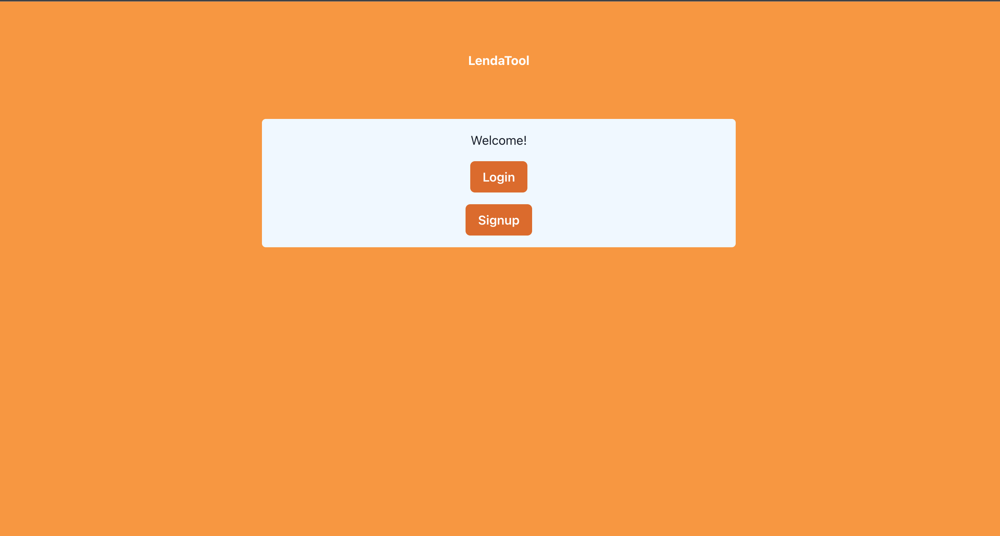
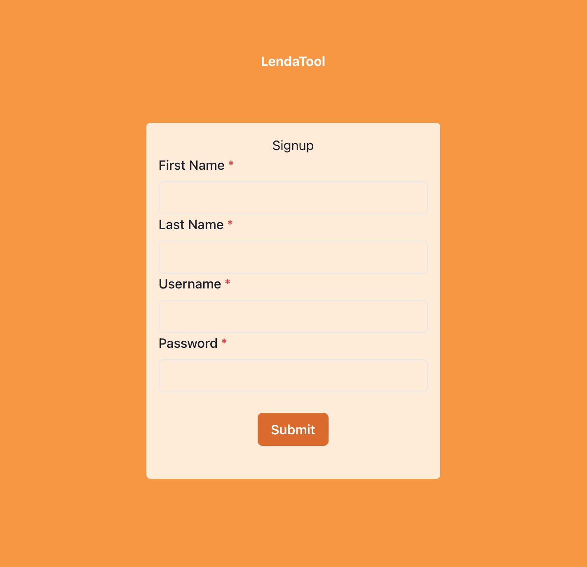
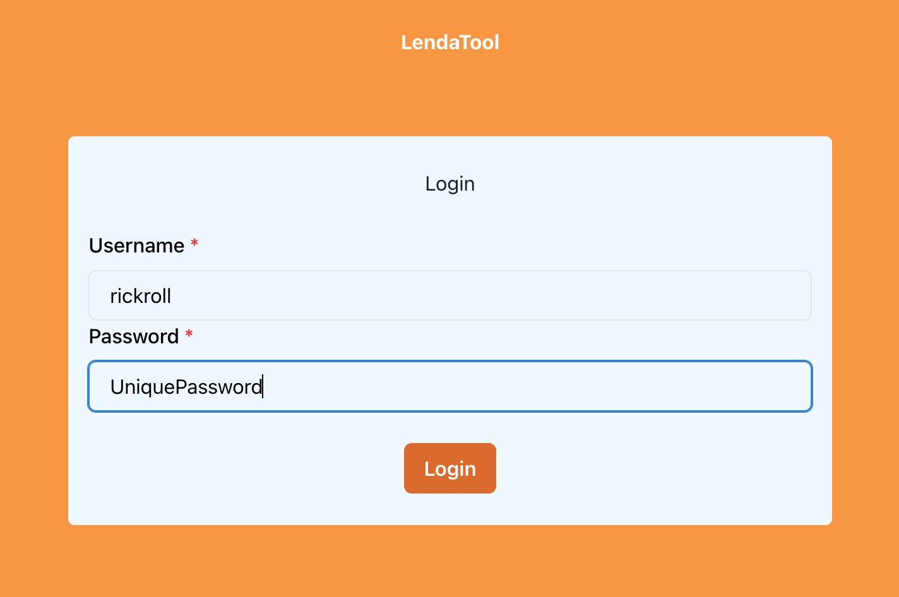

# LendaTool

## Table of Contents
- [Problem](#The-Problem)
- [Solution](#Solutions-to-the-problem)
- [Architecture](#Architecture)
- [Next Steps](#Next-Steps)
- [To Contribute](#To-Contribute)
- [User Interface](#User-Interface-Demo)

## The Problem
Power Tools in the household that you only use a few times a year take up space and lose value over time. 

## Solutions to the problem
A website where you can lend items so that you can extract as much value of your power tool by lending it out. You can add power tools to be displayed to multiple users of the platform and you can join to lend tools from your peers. If you have a career in construction, plumbing and more lend your skills as well. 

## Architecture
Currently, we are employing a fullstack of frontend and backend, leveraging Redux in  the front end for an intitutive storage of stateand SQL in the backend for data integrity, in the future we hope to deploy and create a design to scale and handle heavy traffic. Take a look at the tech stack below for descriptions on different technologies we've used:

#### Backend Tech Stack
- [SQL](https://developer.mozilla.org/en-US/docs/Glossary/SQL) to create database to store user and power tools data
- [Cookie-parser](https://github.com/expressjs/cookie-parser) to persist user data for seamless browser experience
- [SuperTest](https://github.com/visionmedia/supertest) for test driven development 
- [Bcrypt](https://github.com/viniciussanchez/bcrypt) to hash user passwords to ensure security and privacy for users

#### Frontend Tech Stack
- [React](https://reactjs.org/) to utilize virtual DOM for fast updates
- [React-Redux](https://react-redux.js.org/) to have simple access to state from a single source of truth
- [TypeScript](https://www.typescriptlang.org/) to dynamically type our code to prevent program breaking before runtime
- [Framermotion](https://github.com/naver/egjs) to create animations for exciting user expereince 

#### Commands
The following are the most relevant commands 
- `npm run build` builds a bundle file with dependencies in the `buid` directiory
- `npm start` starts the server at localhost:3000
- `npm run dev` starts the a development server at localhost:8080
 
## Next Steps:
- Finish connecting frontend and backend routes 
  - Connect functionality to borrow a tool
  - Conenct functionality to update a tool 
- Build routes to update a tool, borrow and lend a career
- Create toggle star button that renders saved items to user page
- Increase security for user log in by allowing Google authentication via OAuth

## To Contribute:
- Fork this repository
- create a new branch with the name of the feature to add / change
- create a database and add a .env file to add personal keys
- create a PR to the dev branch
- use descriptive commit messages and include comments in the description of your PR

## User Interface Demo

#### Main page

#### Sign up page

#### Login page

#### User Homepage 
